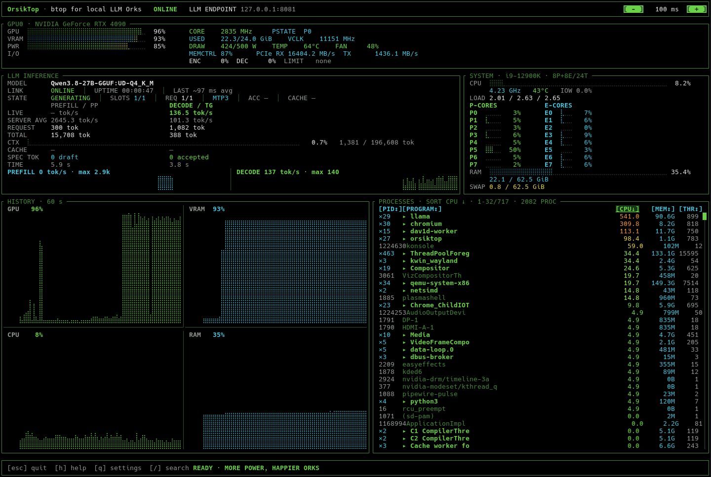

# OrsikTop

**Fast terminal monitoring for local LLM Orks.**

[](https://github.com/exclude-barrier/OrsikTop/actions/workflows/ci.yml)
[](https://github.com/exclude-barrier/OrsikTop/releases/latest)
[](./LICENSE)
[](https://www.rust-lang.org/)
[](https://www.kernel.org/)
[](https://github.com/ggml-org/llama.cpp)

OrsikTop is a Rust TUI that shows **local LLM inference, GPU telemetry (NVIDIA, AMD, Intel), Linux system load and processes** in one terminal dashboard.

It is designed for people running local models with `llama.cpp` who want the important inference and system metrics visible without a browser, daemon, database or account.

> Orsik = fantasy ork. Local models need tokens. Orks need more power.



## Quick start

You need Linux on `x86_64`, a GPU with a working driver (NVIDIA, AMD, or Intel), a recent `llama.cpp`, and `curl` for the installer. Rust is **not** required.

**1. Install OrsikTop:**

```bash
curl --proto '=https' --tlsv1.2 -LsSf \
  https://github.com/exclude-barrier/OrsikTop/releases/latest/download/orsiktop-installer.sh | sh
```

**2. Start llama.cpp with metrics enabled:**

```bash
llama-server -m /path/to/model.gguf --metrics
```

or with the newer `llama serve` form:

```bash
llama serve -hf user/model:Q4_K_M --metrics
```

**3. Run OrsikTop:**

```bash
orsiktop
```

OrsikTop finds the local llama.cpp process automatically (auto discovery) and shows model, throughput, GPU, system and process telemetry in the terminal.

If `orsiktop` returns `command not found` right after installation, see [PATH setup](#make-orsiktop-available-in-the-current-shell).

## What OrsikTop monitors

### LLM inference

OrsikTop reads llama.cpp telemetry and displays:

- model and configured context size
- current context usage
- live prompt-processing / prefill throughput
- live decode / generation throughput
- server-wide average throughput
- prompt, cache and generated token counters
- active and queued/deferred requests
- active / total slots
- speculative decoding / MTP state and acceptance data when available
- cumulative prompt and generation time
- 60-second prefill and decode history
- connection state, uptime and smoothed polling latency
- transient reconnect handling so short polling interruptions do not immediately show the server as offline

With a `--parallel` server (multiple slots) the panel aggregates across slots: `SLOTS busy/total` counts active slots, and the live prefill / decode throughput lines sum the per-slot deltas of the active slots (a task change or counter reset counts as zero, never negative). The context pair (`used / size`) is always read from a single slot — the most-used busy slot, or the most-used slot overall when no slot is busy — because an idle slot keeps its last task's context, so mixing a maximum `used` with a maximum `n_ctx` across slots could pair values from two different slots.

`/metrics` must be enabled in llama.cpp. `/props` is cached and `/slots` is treated as optional telemetry. If `/slots` is unavailable, OrsikTop falls back gracefully instead of inventing values.

### GPU

GPU telemetry is read through a vendor-neutral provider layer: NVIDIA via NVML
(no `nvidia-smi` subprocesses on every refresh), AMD via the amdgpu kernel
sysfs and hwmon, Intel via the i915/xe sysfs and hwmon. OrsikTop discovers
GPUs from Linux DRM/sysfs and picks the backend from the device's vendor.

Depending on the vendor and driver, the available metrics include:

- GPU utilization
- VRAM used / total (discrete GPUs)
- memory-controller utilization
- graphics and memory clocks
- temperature
- power draw and enforced power limit
- P-state and throttle reasons
- fan speed
- encoder / decoder utilization
- PCIe RX / TX throughput
- 60-second GPU and VRAM history

Metrics the driver does not expose are shown as unavailable (`—`) instead of
false zeroes.

### Linux system

- CPU utilization and frequency
- package temperature
- load averages and I/O wait
- Intel P-core / E-core grouping when exposed by Linux
- per-core activity
- RAM and swap usage
- 60-second CPU and RAM history

### Processes

- process list with CPU, memory, thread counts and resident GPU memory
- per-process GPU usage from DRM fdinfo (per-engine utilization, resident
  memory) when the driver exposes it
- sorting by PID, program, CPU, memory or threads
- processes with the same program name grouped together
- right-click groups to expand / collapse them
- keyboard navigation with selection auto-scroll
- double-click to pin a process
- mouse-wheel scrolling
- `/` process search by program, command or PID

## Supported stack

OrsikTop targets a deliberately focused setup:

- Linux
- `x86_64` prebuilt releases
- NVIDIA GPUs through NVML, AMD GPUs/APUs through the amdgpu kernel
  interface, Intel GPUs/APUs through i915/xe and hwmon
- `llama.cpp` (`llama-server` or `llama serve`)
- local or manually configured llama.cpp endpoints
- terminal-first, low-overhead monitoring

The GPU layer runs behind a vendor-neutral provider interface: discovery
comes from Linux DRM/sysfs, and each device is sampled by the backend that
matches its vendor.

## Installation

### Recommended: standalone installer

Install the latest release with:

```bash
curl --proto '=https' --tlsv1.2 -LsSf \
  https://github.com/exclude-barrier/OrsikTop/releases/latest/download/orsiktop-installer.sh | sh
```

The installer is generated with `dist` and installs two executables into:

```text
~/.local/bin/
├── orsiktop
└── orsiktop-update
```

A successful installation currently ends with output similar to:

```text
downloading orsiktop 0.2.4 x86_64-unknown-linux-gnu
installing to /home/user/.local/bin
  orsiktop
  orsiktop-update
```

Those final executable names are normal installer output. The installation is complete at that point.

### Make OrsikTop available in the current shell

The installer can configure future shells, but it cannot change the `PATH` of the terminal that launched it. If `orsiktop` returns `command not found` right after installation, run:

```bash
export PATH="$HOME/.local/bin:$PATH"
hash -r
```

Then verify the installation:

```bash
command -v orsiktop
orsiktop --version
```

Expected output is similar to:

```text
/home/user/.local/bin/orsiktop
orsiktop 0.2.4
```

You can then start OrsikTop with `orsiktop`.

### Persistent PATH fallback

Normally the installer handles the persistent PATH setup. If a newly opened terminal still cannot find `orsiktop`, add `~/.local/bin` to the startup file for your shell.

**Bash:**

```bash
grep -qxF 'export PATH="$HOME/.local/bin:$PATH"' ~/.bashrc || \
  echo 'export PATH="$HOME/.local/bin:$PATH"' >> ~/.bashrc
source ~/.bashrc
```

**Zsh:**

```bash
grep -qxF 'export PATH="$HOME/.local/bin:$PATH"' ~/.zshrc || \
  echo 'export PATH="$HOME/.local/bin:$PATH"' >> ~/.zshrc
source ~/.zshrc
```

**Fish:**

```fish
fish_add_path "$HOME/.local/bin"
```

### Install with Cargo

Cargo remains available for developers and as a fallback installation method.

Install directly from GitHub:

```bash
cargo install --git https://github.com/exclude-barrier/OrsikTop --locked
```

Or install from a local checkout:

```bash
git clone https://github.com/exclude-barrier/OrsikTop.git
cd OrsikTop
cargo install --path . --locked --force
```

Cargo normally installs binaries into `~/.cargo/bin`.

If a Cargo installation succeeds but `orsiktop` is not found:

```bash
export PATH="$HOME/.cargo/bin:$PATH"
hash -r
```

For a persistent Bash setup, for example:

```bash
grep -qxF 'export PATH="$HOME/.cargo/bin:$PATH"' ~/.bashrc || \
  echo 'export PATH="$HOME/.cargo/bin:$PATH"' >> ~/.bashrc
```

## Updating

Standalone installations include the updater next to the main binary:

```bash
orsiktop update
```

`orsiktop update` launches `orsiktop-update`, which updates OrsikTop from GitHub Releases.

OrsikTop does **not** perform automatic background update checks.

If OrsikTop was installed with Cargo instead of the standalone installer, update it with Cargo:

```bash
cargo install --git https://github.com/exclude-barrier/OrsikTop --locked --force
```

## Uninstalling

Standalone installations uninstall themselves:

```bash
orsiktop uninstall
```

This removes `~/.local/bin/orsiktop` and `~/.local/bin/orsiktop-update` and prints every file it removed. Your saved settings are kept; add `--purge` to remove them as well:

```bash
orsiktop uninstall --purge
```

which also deletes the config directory (`$XDG_CONFIG_HOME/orsiktop`, usually `~/.config/orsiktop`).

If OrsikTop was installed with Cargo, `orsiktop uninstall` detects that, leaves the binaries in place, and tells you to run:

```bash
cargo uninstall orsiktop
```

## Auto discovery

With **Auto discovery = ON**, OrsikTop scans local `/proc` entries for a running `llama-server` or `llama serve` process and derives its `--host` and `--port` automatically.

A wildcard bind such as `0.0.0.0` or `::` is reached through loopback.

If no local llama.cpp process is found, OrsikTop uses the saved endpoint and finally falls back to:

```text
http://127.0.0.1:8080
```

Auto discovery only inspects local processes. OrsikTop does **not** scan your LAN for llama.cpp servers.

For a remote or fixed endpoint, disable Auto discovery in Settings and enter the desired host and port, or use `--server` for a one-off override.

## Controls

| Action | Control |
| --- | --- |
| Quit | `Esc` |
| Help | `h` |
| Settings | `q` |
| Process search | `/` |
| Faster refresh | click `[ - ]`, `-` or `[` |
| Slower refresh | click `[ + ]`, `+` or `]` |
| Process navigation | `↑` / `↓`, `j` / `k`, `PgUp` / `PgDn`, `Home` / `End` |
| Scroll processes | mouse wheel |
| Pin process | double-click process row |
| Expand / collapse process group | right-click group |
| Sort processes | click `PID`, `PROGRAM`, `CPU`, `MEM` or `THR` |

The main telemetry refresh interval can be changed live from **100 ms to 10,000 ms**.

## Settings

Press `q` to open the in-app settings menu:

```text
LLM Host/IP      127.0.0.1
LLM Port         8081
GPU              0
Refresh          100 ms
Process refresh  1000 ms
Offline grace    2500 ms
Auto discovery   ON
```

Settings can be changed without restarting OrsikTop.

- `Tab`, `↑`, `↓` — move between fields
- type / `Backspace` — edit values
- `Space`, `←`, `→` — toggle Auto discovery
- `Enter` — validate, save and apply
- `Esc` — discard changes and close

Configuration is stored in:

```text
$XDG_CONFIG_HOME/orsiktop/config
```

or, when `XDG_CONFIG_HOME` is not set:

```text
~/.config/orsiktop/config
```

Saved settings include the LLM endpoint, GPU selection, main refresh interval, process refresh interval, offline grace period and auto-discovery state.

## CLI

Show the built-in help:

```bash
orsiktop --help
```

Show the installed version:

```bash
orsiktop --version
```

Subcommands:

| Command | Effect |
| --- | --- |
| `orsiktop update` | Updates a standalone installation to the latest release |
| `orsiktop diag` | Prints a no-secrets diagnostics summary for bug reports |
| `orsiktop uninstall` | Removes the standalone binaries, keeps the config |
| `orsiktop uninstall --purge` | Removes the binaries and the config directory |

Available one-off overrides for a single run:

| Option | Environment variable | Purpose |
| --- | --- | --- |
| `--server` | `ORSIKTOP_SERVER` | llama.cpp endpoint; disables auto discovery for that run |
| `--gpu` | `ORSIKTOP_GPU` | GPU by PCI BDF (any vendor), vendor UUID (NVIDIA) or a bare number (n-th NVIDIA GPU; on NVIDIA-less machines the n-th device overall) |
| `--gpu-index` | `ORSIKTOP_GPU_INDEX` | legacy n-th NVIDIA GPU index (prefer `--gpu`) |

Examples:

```bash
orsiktop --server http://192.168.1.20:8081
orsiktop --interval-ms 500
orsiktop --gpu 0000:41:00.0
```

## Troubleshooting

### `orsiktop: command not found`

First confirm that the standalone installer created the binary:

```bash
ls -l "$HOME/.local/bin/orsiktop"
```

If it exists, activate the path in the current shell:

```bash
export PATH="$HOME/.local/bin:$PATH"
hash -r
orsiktop --version
```

If a new terminal still cannot find it, use the persistent PATH instructions in the installation section above.

### LLM telemetry is offline or incomplete

Make sure llama.cpp was started with metrics enabled:

```bash
--metrics
```

You can test the metrics endpoint directly:

```bash
curl http://127.0.0.1:8080/metrics
```

Adjust the port if your llama.cpp server uses a different one.

If you use a fixed or remote server, either configure it in OrsikTop Settings or run:

```bash
orsiktop --server http://HOST:PORT
```

### GPU data is unavailable

OrsikTop discovers GPUs from Linux DRM/sysfs and reads each device's native
interface: NVIDIA through NVML (loaded dynamically via `nvml-wrapper`, no
`nvidia-smi` subprocesses), AMD and Intel through their kernel sysfs and
hwmon. A normal vendor driver installation provides these interfaces.

Check that your driver is working:

```bash
nvidia-smi            # NVIDIA
cat /sys/class/drm/card*/device/vendor   # any vendor (0x10de NVIDIA, 0x1002 AMD, 0x8086 Intel)
```

Metrics the driver does not expose are shown as `—` (unavailable) rather than
false zeroes. OrsikTop does not bundle GPU drivers or vendor libraries.

## Release integrity

Standalone releases are built and published through GitHub Actions with `dist`.

Release artifacts include SHA-256 checksums and GitHub artifact attestations.

The release page contains the installer, updater, prebuilt archive, checksums and source archive for each published version.

## Build from source

```bash
git clone https://github.com/exclude-barrier/OrsikTop.git
cd OrsikTop
cargo build --release --locked
./target/release/orsiktop
```

## Architecture

```text
src/
├── main.rs         terminal setup, CLI, subcommands and updater entry point
├── config.rs       persistent runtime settings
├── domain.rs       normalized, vendor-neutral telemetry models
├── app.rs          event loop and telemetry workers
├── llama.rs        llama.cpp /metrics, /slots, /props and server discovery
├── discovery.rs    vendor-neutral GPU discovery (Linux DRM/sysfs)
├── discovery_llm.rs  llama.cpp server discovery (processes + config)
├── gpu_map.rs      llama.cpp server → GPU(s) mapping
├── drm.rs          per-process GPU usage from DRM fdinfo
├── providers/      GpuProvider interface and vendor backends
│   ├── nvidia.rs    NVIDIA NVML backend
│   ├── amd.rs       AMD amdgpu sysfs + hwmon backend
│   └── intel.rs     Intel i915/xe sysfs + hwmon backend
├── gpu.rs          GPU provider factory and PCIe link math
├── cpu.rs          CPU topology (hybrid P/E/LP classification)
├── cpu_sensors.rs  CPU frequency, temperature and RAPL power
├── diagnostics.rs  `orsiktop diag` bug-report summary
├── system.rs       filesystem abstraction (real + fixture)
└── ui.rs           ratatui rendering, controls and histories
```

GPU/system sampling and llama.cpp HTTP polling run independently. A slow `/metrics` or `/slots` response therefore does not block keyboard/mouse input or fast GPU updates.

## Design goals

OrsikTop should stay:

- fast
- readable
- useful for local LLM inference
- easy to run
- deliberately small

Features are added when they improve monitoring rather than simply making the TUI busier.

## Status

OrsikTop is still early software. The GPU layer runs behind a vendor-neutral provider interface (NVIDIA, AMD and Intel backends; see the [hardware support matrix](docs/HARDWARE_SUPPORT.md)), and the remaining focus is hardening (NVIDIA MIG) rather than new vendor support.

Bug reports and focused feature requests are welcome through GitHub Issues.

## License

Apache License 2.0. See [LICENSE](./LICENSE) and [NOTICE](./NOTICE).
